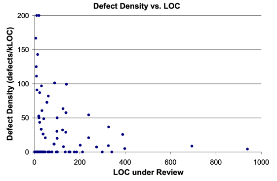

# Good Git and Commit Habits

<!-- TOC -->
* [Good Git and Commit Habits](#good-git-and-commit-habits)
  * [Atomic and Single-Purpose Commits](#atomic-and-single-purpose-commits)
  * [Frequent Commits on a Personal Branch + Cleanup](#frequent-commits-on-a-personal-branch--cleanup)
  * [Meaningful Commit Messages](#meaningful-commit-messages)
  * [Pull from the main branch often](#pull-from-the-main-branch-often)
  * [Have Short-Lived Branches](#have-short-lived-branches)
  * [Rewriting commits locally](#rewriting-commits-locally)
  * [CLI > GUI](#cli--gui)
  * [Consistency](#consistency)
  * [References](#references)
<!-- TOC -->

> Note: This reflects the general consensus.  
> Other teams may have slight variations or different practices.

## Atomic and Single-Purpose Commits
Similar to the Single Responsibility Principle, commits should do one complete logical task (single unit of work)
and ideally leave the codebase in a working state (passes the test suite).
Avoid mixing unrelated changes in a single commit.
For instance, do not mix logic with formatting, refactoring, or dependency changes.
Relating back to Conventional Commits, limit commits to one type (fix, feat, refactor, style, docs, etc.).

Strive for small commits. The focus is on the logical scope of the change and less on the number of lines changed.
Though, a [Cisco study](https://static0.smartbear.co/support/media/resources/cc/book/code-review-cisco-case-study.pdf) on code
reviews found that the effectiveness of defect detection decreases significantly beyond 200 lines per review and recommends no more than 400 lines.



Small, focused commits are easier to understand, test, and revert.
They are less likely to cause merge conflicts and are beneficial for tools such as `git blame` and `git bisect`.

If a feature is large, consider breaking it into multiple incremental commits. Each independent step is a commit.
More manageable, smaller steps also help with problem-solving and are less overwhelming.

## Frequent Commits on a Personal Branch + Cleanup
Committing early and often avoids losing work, easy debugging (isolated changes), and fearless experimentation (can revert back to previous stable commit).

However, frequent commits may not be atomic. They may not pass tests and individually can be incomplete work.

The solution is to reorganize the intermediate commits (especially for messy messages or exploratory commits).
Before merging into the main branch, you can:
1. Squash intermediate commits (be aware that the result should be small and single-purpose)
2. Use `git rebase -i` (interactive rebase) to reorder, squash/combine, edit, or delete commits.
3. Perform a soft reset on your branch and create new commits with `git add -p` (partial committing or committing specific "hunks" of change)


To sum up, commit as frequently and conveniently as needed during development.
Once you have working code, clean up the history locally before merging.
This results in a clean branch history while still encouraging developers not to hold back commits.

Also, thoroughly test your code before pushing/sharing it with others (especially to the main/stable branch).

> Tip: If you want to commit just because you need a clean working copy (to checkout a branch, pull in changes, etc.),
> consider `git stash` or `git worktree` (checkout multiple branches from the same repo at the same time)

## Meaningful Commit Messages
- Describe what change was made, how it resolves an issue/need, and why it was made
- Follow the established commit standards (usually some form of Conventional Commit)
- Clear messages are beneficial for code reviews and for understanding project history

## Pull from the main branch often
Keep your branch up to date to reduce drift and potential merge conflicts.

## Have Short-Lived Branches
Merge changes back into the main branch as soon as the feature is complete and reviewed.

Long-running branches increase the risk of complex merges, conflicts, and large integration bugs.

## Rewriting commits locally
If your commit message has a typo or if you forgot to include a change (add/modify/remove a file):

To update the most recent commit on your current branch:
```bash
git commit --amend
```

For more complex rewrites, use `git rebase -i`
```bash
# Example: Combine the last 3 commits interactively
git rebase -i HEAD~3
```

> Note: Commits are immutable.
> Both `amend` and `rebase` create new commits (with new SHAs), so it is safer to do them locally.
>
> You should consider pushed work as final unless you have good reason to change it.
> Avoid altering published branch history (such as with a force push), as it can confuse collaborators.
> If you make an error and the commit is public, use `git revert` instead.


## CLI > GUI
- GUIs may only provide a subset of Git functionality
- Some GUI tools have bugs

## Consistency
Follow (and agree on) the repository’s established patterns (usually defined in `CONTRIBUTING.md`).  
This includes branching strategy/workflow, branch naming conventions, commit style, and pull request process.  
Consistent Git practices make project history readable, CI/CD automation predictable, and team collaboration efficient.

## References

Git Rewrite History:
https://git-scm.com/book/en/v2/Git-Tools-Rewriting-History

Cisco Code Review Study:
https://static0.smartbear.co/support/media/resources/cc/book/code-review-cisco-case-study.pdf

Atomic Commits Pros and Cons:
https://gitbybit.com/gitopedia/best-practices/atomic-commits

Logically atomic commit and why:
https://benmatselby.dev/post/logical-commits/

Atomic Commits Blog:
https://www.aleksandrhovhannisyan.com/blog/atomic-git-commits/

"Do"s and "Don't"s of Git:
https://sethrobertson.github.io/GitBestPractices/

Good Commits vs. Bad Commits: https://medium.com/@jeromedecinco/git-best-practices-for-commits-5147a7fa3d12

Workflow for Experiments - Scratchpad/Exploratory Branches:
https://julien.ponge.org/blog/a-workflow-for-experiments-in-git-scratchpad-branches/


Good Commit Practices:
https://www.simplethread.com/what-makes-a-good-git-commit/

https://xdg.me/a-survey-of-git-best-practices/

https://medium.com/@lorenzen.jacob/good-git-habits-73db205533d0

https://gist.github.com/luismts/495d982e8c5b1a0ced4a57cf3d93cf60

https://www.bairesdev.com/blog/git-best-practices-2/


Git concepts with visualization:

https://www.youtube.com/watch?v=hZS96dwKvt0&themeRefresh=1

https://marklodato.github.io/visual-git-guide/index-en.html

https://onlywei.github.io/explain-git-with-d3/#