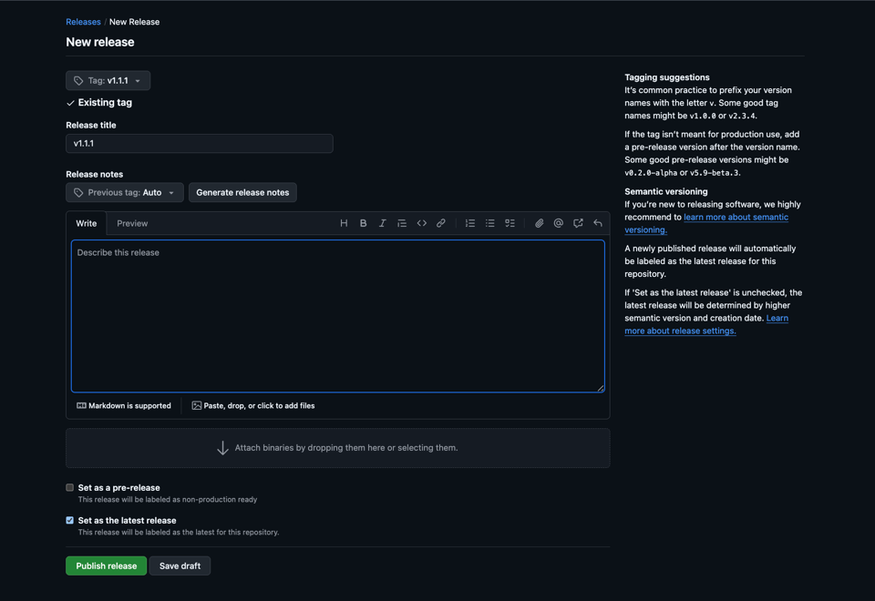

# Release Workflow
### *(under construction)*
\[ concrete `mvn` and `git` steps to produce the next release. Separate from deployment. \]

---

# Release Process

<!-- TOC -->
* [Release Process](#release-process)
  * [With Maven Release Plugin](#with-maven-release-plugin)
    * [Requirements](#requirements)
      * [Setup Git Authentication](#setup-git-authentication)
        * [Add SSH key to the ssh-agent](#add-ssh-key-to-the-ssh-agent)
        * [Add public key to GitHub](#add-public-key-to-github)
        * [Quick auth test](#quick-auth-test)
    * [1. Add the Release Plugin to `pom.xml`](#1-add-the-release-plugin-to-pomxml)
    * [2. [OPTIONAL] Dry run](#2-optional-dry-run)
    * [3. Prepare + Release](#3-prepare--release)
      * [Prepare](#prepare)
      * [Perform (deploy from the tag)](#perform--deploy-from-the-tag-)
    * [4. Manually create the GitHub Release page](#4-manually-create-the-github-release-page)
  * [[OPTIONAL] Release-Please GitHub Action](#optional-release-please-github-action)
    * [Preparation](#preparation)
    * [Release process](#release-process)
  * [References](#references)
<!-- TOC -->

## With Maven Release Plugin

### Requirements

- Maven + JDK
- Git
- `pom.xml` prepared for Central deployment. See deployment guide for more info
    - Have correct `<scm>` URLs in `pom.xml` with respective protocol (HTTPS/SSH)
    - For SSH, you need to have SSH key (see below for the steps). For HTTPS, have Personal Access Tokens (PATs).
- On SNAPSHOT version in `pom.xml`
- On a release branch (mindful of branch protection or push permission)
- Clean working tree: no uncommitted changes, `git status` empty


#### Setup Git Authentication

With `<developerConnection>scm:git:git@github.com:...` in `pom.xml`, we will use SSH key approach.

> Note: Alternative is Personal Access Tokens (PATs) for `<developerConnection>scm:git:https://github.com/...`

Generate SSH key pair with your GitHub email address:
```bash
ssh-keygen -t ed25519 -C "your_email@example.com"
```
You will be prompted to:
1. Enter file in which to save the key (press Enter to accept default `~/.ssh/id_ed25519`)
2. Enter a passphrase

This creates:
- Private key: `~/.ssh/id_ed25519` (keep secret)
- Public key: `~/.ssh/id_ed25519.pub` (shareable)

##### Add SSH key to the ssh-agent

<details>
  <summary>Windows</summary>

```bash
# Start the ssh-agent in the background.
eval "$(ssh-agent -s)"

# add key to the agent
ssh-add ~/.ssh/id_ed25519
```

</details>


<details>
  <summary>macOS</summary>

```bash
# Start the ssh-agent in the background.
eval "$(ssh-agent -s)"

# For macOS Sierra 10.12.2 or later, you will need to modify the ~/.ssh/config
# Check if config exists
open ~/.ssh/config

# If config doesn't exist, make one
touch ~/.ssh/config
```

Modify the config to have the following:
```text
Host github.com
  AddKeysToAgent yes
  UseKeychain yes
  IdentityFile ~/.ssh/id_ed25519
```

> - If you chose not to add a passphrase to your key, you should omit the `UseKeychain` line.
> - If you see a `Bad configuration option: usekeychain` error, add an additional line to the configuration's' `Host *.github.com` section.
> ```text
> Host github.com
>   IgnoreUnknown UseKeychain
> ```

```bash
# Add key to the agent
ssh-add --apple-use-keychain ~/.ssh/id_ed25519
```

</details>


##### Add public key to GitHub
1. Copy this output:
```bash
cat ~/.ssh/id_ed25519.pub
```

2. In GitHub, go to `Settings` > `SSH and GPG keys` > `New SSH key`


3. Add a title
4. Key type: `Authentication Key`
5. In "Key" field, paste the public key
6. Click "Add SSH key" button

##### Quick auth test
```bash
ssh -T git@github.com
```
Should see the following message if SSH key is set up correctly with GitHub:
```text
Hi <username>! You've successfully authenticated, but GitHub does not provide shell access.
```

---

### 1. Add the Release Plugin to `pom.xml`
```xml
<build>
  <plugins>
    <!-- Maven Release Plugin -->
    <plugin>
      <groupId>org.apache.maven.plugins</groupId>
      <artifactId>maven-release-plugin</artifactId>
      <version>3.1.1</version>
      <configuration>
        <!-- Tag name like v0.1.0 -->
        <tagNameFormat>v@{project.version}</tagNameFormat>

        <!-- Build to run in release:prepare (prevents broken releases) -->
        <preparationGoals>clean verify</preparationGoals>

        <!-- Profile to use during perform (Central publish profile) -->
        <releaseProfiles>deployment</releaseProfiles>

        <!-- Goal to run during perform (deploy from the tag) -->
        <goals>deploy</goals>

        <!-- push commits & tag to origin during release:prepare-->
        <pushChanges>true</pushChanges>
      </configuration>
    </plugin>
  </plugins>
</build>
```

### 2. [OPTIONAL] Dry run
```bash
# on release branch, clean tree
mvn -B release:prepare -DdryRun=true \
  -DreleaseVersion=0.1.1 \
  -DdevelopmentVersion=0.1.2-SNAPSHOT \
  -Dtag=v0.1.1
```


```bash
# review generated files (release.properties, release POM, and next snapshot POM)
mvn release:clean  # clean up the dry-run
```

> `-DdryRun=true` on release:prepare simulates the prepare phase without making Git commits/tags or POM edits

> `release:clean` cleans up temporary files created by release:prepare (`release.properties`, backup POMs, dry-run output)

### 3. Prepare + Release

#### Prepare

```bash
mvn -B release:prepare \
  -DreleaseVersion=0.1.1 \
  -DdevelopmentVersion=0.1.2-SNAPSHOT \
  -Dtag=v0.1.1
```

What this does:
- updates `0.1.1-SNAPSHOT` to `0.1.1` in the POM
- commit `“[maven-release-plugin] prepare release v0.1.1”`
- create tag `v0.1.1`
- update POM to 0.1.2-SNAPSHOT
- commit `“[maven-release-plugin] prepare for next development iteration”`
- if `<pushChanges>` is true, push both commits and tag to origin

> Note: maven-release-plugin by default does not read commit messages (following Conventional Commits) to
> choose the next version.
>
> However, you can do it via custom Version Policy (plugin param: -DprojectVersionPolicyId=...) like in
> https://maven.basjes.nl/


<details>
  <summary>What to do if <code>&lt;pushChanges&gt;</code> is false?</summary>

You can keep the prepare-made tag and push it (tag on release-branch commit).

It is fine if you don’t squash/rebase the pull request
```bash
# push the branch and tag
git push -u origin <release-branch>
git push origin v0.1.1
```

</details>

<details>
  <summary>How to undo a failed <code>release:prepare</code>?</summary>

To restore the POM to the state before `release:prepare`, clean up generated temp/backup files, and
undo the commits and tag (that weren't pushed to remote yet), you can do `release:rollback`
```bash
mvn release:rollback
```
</details>


<details>
  <summary>How to resolve <code>Permission denied (publickey)</code>?</summary>

You may encounter this error. For instance:
```text
[ERROR] Failed to execute goal org.apache.maven.plugins:maven-release-plugin:3.1.1:perform (default-cli) on project xml-validation-central-maven-test: Unable to checkout from SCM
[ERROR] Provider message:
[ERROR] The git-clone command failed.
[ERROR] Command output:
[ERROR] Cloning into 'checkout'...
[ERROR] git@github.com: Permission denied (publickey).
[ERROR] fatal: Could not read from remote repository.
```

Check if SSH key/agent is set up and if public key has been added to GitHub.
Revisit [Setup Git Authentication](#setup-git-authentication)

</details>

#### Perform (deploy from the tag)
```bash
mvn release:perform

# If have a custom settings.xml file
# mvn release:perform -s custom_settings.xml
```
What this does:
- Checks out the release tag into `target/checkout`
- Runs configured goals (`deploy`) with the profile (`deployment`)
    - `mvn -Pdeployment deploy` - sign and upload artifacts to Maven Central via `central-publishing-maven-plugin`


### 4. Manually create the GitHub Release page
With tag v0.1.1 exists
1. Go to GitHub > Releases > Draft a new release
2. Pick tag v0.1.1
3. In Title & body, paste your notes/changelog
4. Publish the release

Example:



---

## [OPTIONAL] Release-Please GitHub Action


This GitHub workflow uses Release-Please
to manage versioning, tagging, changelog, and GitHub Releases based on Conventional Commits. It can be a
Maven Release Plugin replacement for release management.


Whenever commits are merged to main, the action reads commit messages to determine the next SemVer,
opens/updates a release pull request. Once the release pull request is merged to main, it creates a tag (vX.Y.Z),
updates the `pom.xml` version, and publishes a release page.

### Preparation

`.github/workflows/release-please.yml`:
```yaml
name: release-please
on:
  push:
    branches: [ main ]
  workflow_dispatch: {}

permissions:
  contents: write
  pull-requests: write

concurrency:
  group: release-please-${{ github.ref }}
  cancel-in-progress: true

jobs:
  release:
    runs-on: ubuntu-latest
    steps:
      - name: Release Please
        uses: googleapis/release-please-action@v4
        with:
          release-type: maven
          manifest-file: ".release-please-manifest.json"
          config-file: "release-please-config.json"
```

`.release-please-manifest.json`:
```json
{
  ".": "1.1.0"
}
```
This tracks the current release version.

`release-please-config.json`:
```json
{
  "$schema": "https://raw.githubusercontent.com/googleapis/release-please/main/schemas/config.json",
  "include-v-in-tag": true,
  "extra-files": [
    {
      "type": "xml",
      "path": "pom.xml",
      "xpath": "//_:project/_:version"
    }
  ],
  "changelog-types": [
    { "type": "feat", "section": "Features" },
    { "type": "fix",  "section": "Bug Fixes" },
    { "type": "perf", "section": "Performance" },
    { "type": "refactor", "section": "Refactoring", "hidden": true },
    { "type": "docs", "section": "Documentation", "hidden": false },
    { "type": "test", "section": "Tests", "hidden": true },
    { "type": "build","section": "Build System", "hidden": true },
    { "type": "ci",   "section": "CI", "hidden": true },
    { "type": "chore","section": "Chores", "hidden": true },
    { "type": "revert","section": "Reverts", "hidden": true }
  ]
}
```

### Release process

1. Release-Please GitHub Action opens a release pull request
2. You review and merge the pull request
3. The workflow creates the tag vX.Y.Z, updates `pom.xml` version + `CHANGELOG.md`, and makes a GitHub Release
4. You locally check out that tag and run mvn deploy to publish to Central

```bash
# After merging release pull request

git fetch --all --tags

# Check out the released tag
git checkout vX.Y.Z

# pom.xml now should be X.Y.Z (non-SNAPSHOT)

# Build, sign, and deploy to Central (do not run maven-release-plugin here)
mvn -Pdeployment clean deploy

# If have a custom settings.xml file
# mvn -Pdeployment clean deploy -s custom_settings.xml
```

## References

SSH
- https://docs.github.com/en/authentication/connecting-to-github-with-ssh/generating-a-new-ssh-key-and-adding-it-to-the-ssh-agent
- https://docs.github.com/en/authentication/connecting-to-github-with-ssh/adding-a-new-ssh-key-to-your-github-account

Maven Release Plugin
- https://maven.apache.org/maven-release/maven-release-plugin/
- https://maven.apache.org/maven-release/maven-release-plugin/usage.html

Conventional Commits for the Maven Release Plugin
- https://maven.basjes.nl/

Release-Please
- https://github.com/googleapis/release-please-action
- https://github.com/googleapis/release-please